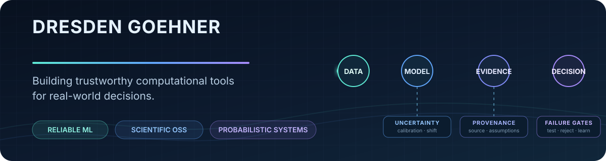

  

  <a href="https://github.com/DresdenGman/open-source-contributions">Open-source portfolio</a>
  ·
  <a href="https://gert-d.vercel.app">GERT</a>
  ·
  <a href="https://epsilon-livid.vercel.app/landing">EPSILON</a>
  ·
  <a href="https://dresdengman.github.io/the-backtest-that-lied">The Backtest That Lied</a>
  ·
  <a href="https://github.com/DresdenGman/pjm-polar-vortex-paper">PJM research</a>

I am a student developer working at the intersection of applied mathematics, machine learning, and scientific software. I build systems that make **uncertainty, provenance, assumptions, and failure conditions** visible—then test whether their conclusions still hold outside a clean demonstration.

My work has moved from training models and optimizing headline accuracy toward a harder question: **when should a computational result be trusted?** That question now connects my open-source engineering, energy-risk research, and quantitative decision tools.

## Open-source engineering

| Verified outcome | Snapshot |
| --- | ---: |
| Merged upstream pull requests | **15** |
| Upstream repositories | **13** |
| Open-source organizations | **12** |
| Deduplicated reach of recipient repositories | **246K+ stars** |

Repository stars are ecosystem-scale context, not stars earned by my patches. Repositories are counted once; methodology and dated evidence are available in the <a href="https://github.com/DresdenGman/open-source-contributions/blob/main/METHODOLOGY.md">portfolio methodology</a>.

Selected work:

- **[MAPIE #953](https://github.com/scikit-learn-contrib/MAPIE/pull/953)** — added AUROC and AUARC APIs for evaluating uncertainty estimates, including validation, tests, documentation, and review-driven iteration.
- **[Fairlearn #1674](https://github.com/fairlearn/fairlearn/pull/1674)** — integrated confidence-interval detection into the public `MetricFrame` plotting API with edge-case coverage.
- **[BeeWare Briefcase #2939](https://github.com/beeware/briefcase/pull/2939)** — hardened GitHub Actions through least-privilege permissions, pinned action references, credential-exposure reduction, and zizmor scanning.
- **[StatsForecast #1175](https://github.com/Nixtla/statsforecast/pull/1175)** — added conformal-error prediction intervals and supporting tests.
- **[NeuralForecast #1563](https://github.com/Nixtla/neuralforecast/pull/1563)** — implemented FreDF, a loss combining time- and frequency-domain error.

Every merged contribution has an evidence-backed engineering writeup covering diagnosis, implementation, validation, review, and lessons learned: **[explore all merged work →](https://github.com/DresdenGman/open-source-contributions)**

## Featured work

| Project | What it investigates |
| --- | --- |
| **[GERT — Grid Extreme Risk Toolkit](https://github.com/DresdenGman/Grid-Extreme-Risk-Toolkit-GERT-)** · [Live](https://gert-d.vercel.app) | A probabilistic decision-support system for grid stress, tail risk, scenario intervention, and explicit data/model provenance. Its real-model path is gated by calibration rather than promoted when the evidence is insufficient. |
| **[EPSILON — Quantitative Decision Lab](https://github.com/DresdenGman/EPSILON-trading-simulator)** · [Live](https://epsilon-livid.vercel.app/landing) | A research environment for turning market ideas into falsifiable claims while keeping execution assumptions, provenance, negative evidence, and failure conditions visible. |
| **[The Backtest That Lied](https://github.com/DresdenGman/the-backtest-that-lied)** · [Live](https://dresdengman.github.io/the-backtest-that-lied) | A forensic ML study in which a near-perfect signal collapsed after leakage repair and failed again under costs and liquidity constraints—leading to a documented decision to terminate the strategy. |
| **[PJM Extreme-Winter Forecasting](https://github.com/DresdenGman/pjm-polar-vortex-paper)** | Ongoing research into how ordinary annual validation can conceal probabilistic forecast failure during rare cold events. The manuscript remains in development. |

## How I work

- **Negative results are results.** I preserve failed tests and stop hypotheses that do not survive their decision gates.
- **Reliability needs more than accuracy.** I examine uncertainty, calibration, subgroup behavior, leakage, distribution shift, and reproducibility.
- **Claims should remain inspectable.** I separate simulated from live data, document provenance, and link public statements to code, tests, or primary records.
- **Review is part of the engineering.** Maintainer feedback, scope reduction, edge cases, and regression tests are recorded—not hidden from the final story.

## Current direction

I am connecting two lines of work that began separately: **applied modeling** and **reviewed open-source engineering**. My next projects revisit real modeling problems with stronger validation, uncertainty quantification, and fairness analysis—using the same standards I learned while contributing to public scientific software.

  <a href="https://github.com/DresdenGman/open-source-contributions"><strong>Contribution dashboard and merged writeups →</strong></a>

